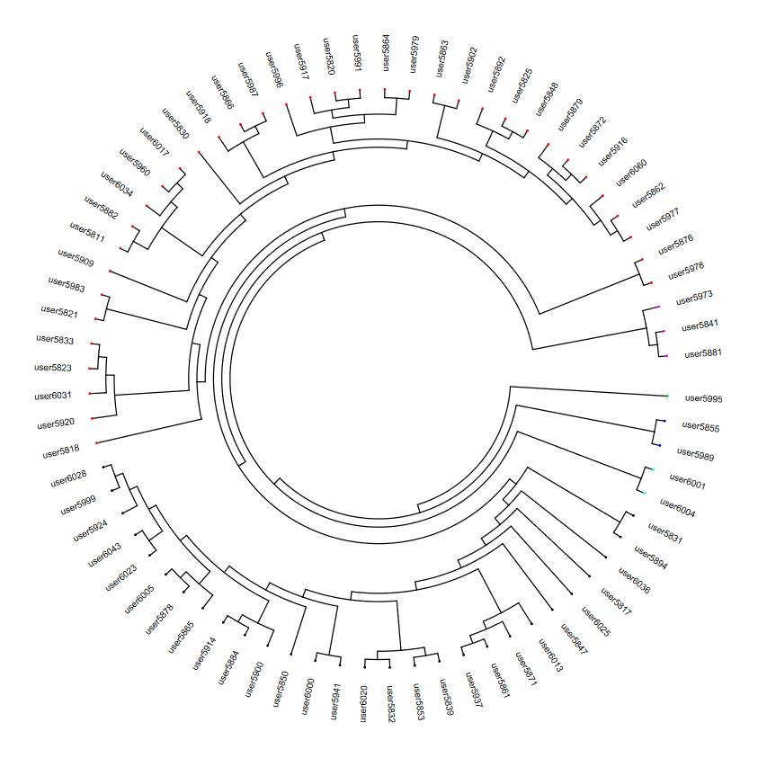

# OpenSNP-dendrogram
Phylogenetic tree generator for samples from OpenSNP.
Tested on Ubuntu LTS 20.04 for Windows.

### Packages to install
1. htslib
1. bgzip
1. bcftools
1. R-base

### Data to install
1. Genome sequence, primary assembly (GRCh37) in .fa.gz format (download here: https://www.gencodegenes.org/human/release_39lift37.html)
1. 23andme SNP files in .23andme.txt format (download here: https://archive.org/details/opensnp_data_dumps)

### How to run
Invoke from command line: `sh convert.sh`

### To-do list
1. Make radial dendrogram instead
2. Insert curl command to download and unpack datasets for OpenSNP and GRCh37
3. Insert install commands for libraries
4. Additional code to clean OpenSNP/23andme data, and make cross-compatible between releases
